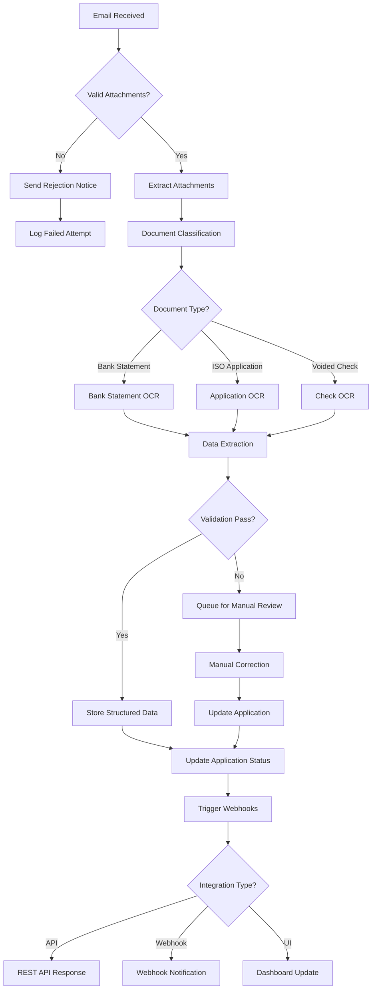
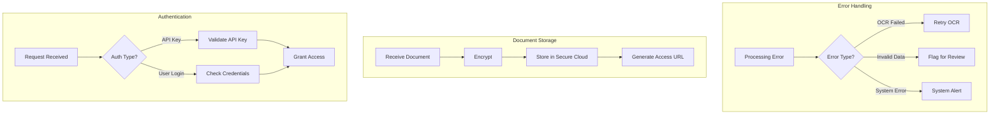
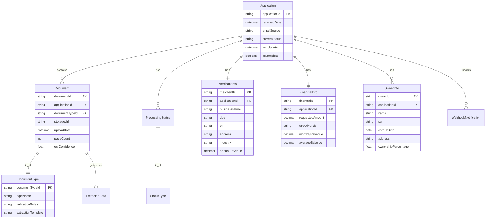
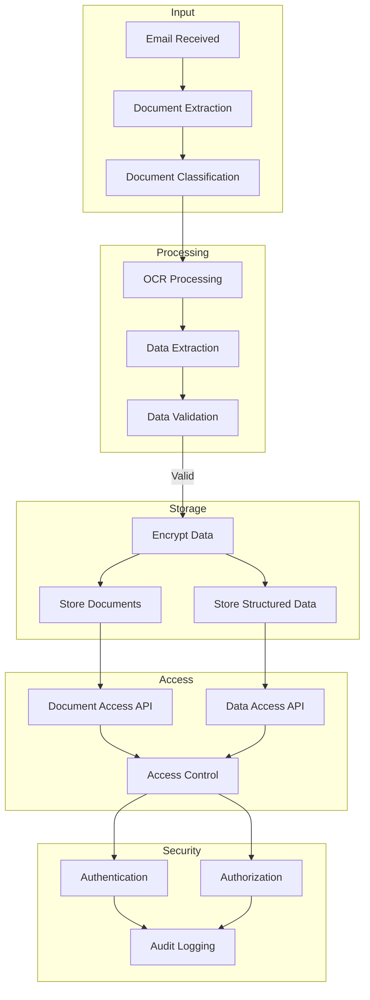

# Product Requirements Document (PRD)

# 1. INTRODUCTION

## 1.1 Purpose

This Software Requirements Specification (SRS) document provides a comprehensive description of the AI-Driven Application Intake Platform for Dollar Funding. It serves as the primary reference for technical and functional requirements for all stakeholders involved in the development process, including:

- Development and QA teams
- Project managers and technical leads
- Dollar Funding's operations management
- System architects and integrators
- Maintenance and support personnel

## 1.2 Scope

The AI-Driven Application Intake Platform is an automated system designed to revolutionize the Merchant Cash Advance (MCA) application processing workflow at Dollar Funding. The system encompasses:

### 1.2.1 Core Capabilities
- Automated email monitoring and document processing
- Intelligent document classification and OCR processing
- Structured data extraction from various document types
- Secure document storage and retrieval
- RESTful API integration capabilities
- Web-based administrative interface

### 1.2.2 Key Benefits
- Reduction in manual data entry requirements
- Decreased processing time from receipt to structured data
- Improved accuracy in data extraction
- Enhanced security and compliance in document handling
- Scalable processing capacity up to 1000+ daily applications
- Real-time integration capabilities via webhooks

### 1.2.3 System Boundaries
- Processes applications received at submissions@dollarfunding.com
- Handles PDF documents including bank statements, ISO applications, and voided checks
- Supports both machine-printed and handwritten text extraction
- Maintains document and data security throughout the processing lifecycle
- Provides data access through both API and web interface
- Delivers processing status updates via configurable webhooks

# 2. PRODUCT DESCRIPTION

## 2.1 Product Perspective
The AI-Driven Application Intake Platform operates as a standalone system that integrates with Dollar Funding's existing email infrastructure and downstream processing systems. The platform serves as the initial touchpoint for all incoming MCA applications, transforming the current manual intake process into an automated workflow. It interfaces with:

- Email servers (SMTP/IMAP) for monitoring submissions@dollarfunding.com
- External OCR and ML services for document processing
- Secure cloud storage for document management
- Dollar Funding's existing CRM and processing systems via REST APIs
- Third-party systems through webhook integrations

## 2.2 Product Functions
- Automated Email Processing
  - Continuous monitoring of designated email inbox
  - Attachment extraction and validation
  - Document classification and sorting

- Document Processing
  - OCR processing of machine-printed and handwritten text
  - Intelligent data extraction from multiple document types
  - Structured data validation and formatting

- Data Management
  - Secure document storage and retrieval
  - Application status tracking
  - Data export in multiple formats

- Integration Capabilities
  - RESTful API endpoints for data access
  - Webhook notifications for real-time updates
  - Secure API authentication and authorization

- Administrative Functions
  - Web-based dashboard for application monitoring
  - User management and access control
  - System configuration and monitoring

## 2.3 User Characteristics

### Operations Team
- Technical proficiency: Intermediate
- Primary tasks: Application review, data verification
- Access needs: Web interface, basic reporting

### System Administrators
- Technical proficiency: Advanced
- Primary tasks: System configuration, user management
- Access needs: Full system access, advanced settings

### API Integration Users
- Technical proficiency: Expert
- Primary tasks: System integration, automation
- Access needs: API documentation, webhook configuration

## 2.4 Constraints
- Security Requirements
  - GLBA compliance for financial data protection
  - Encryption for data at rest and in transit
  - Multi-factor authentication for administrative access

- Technical Limitations
  - 5-minute maximum processing time per application
  - Maximum file size of 25MB per attachment
  - Support for PDF format documents only

- Operational Constraints
  - 99.9% system availability requirement
  - 95% minimum OCR accuracy requirement
  - Maximum 1000 daily application processing capacity

## 2.5 Assumptions and Dependencies
### Assumptions
- Stable email server infrastructure
- Consistent document format from ISO partners
- Reliable internet connectivity
- Adequate storage capacity for document retention

### Dependencies
- Third-party OCR service availability
- Email server uptime and accessibility
- Cloud storage service reliability
- External API service stability
- SSL certificate maintenance
- Regular system backup execution

# 3. PROCESS FLOWCHART

# 4. FUNCTIONAL REQUIREMENTS

## 4.1 Email Processing System

### ID: F001
### Description
Automated system for monitoring and processing incoming emails at submissions@dollarfunding.com
### Priority: High

| Requirement ID | Requirement Description | Acceptance Criteria |
|---------------|------------------------|-------------------|
| F001.1 | Continuous IMAP/SMTP monitoring of designated email inbox | - Email monitoring active 24/7 - Maximum 1-minute delay in email detection |
| F001.2 | Extraction of PDF attachments from incoming emails | - Support for single/multiple attachments - Maximum file size: 25MB - PDF format validation |
| F001.3 | Automated response system for received applications | - Confirmation email sent within 2 minutes - Include unique application reference number |
| F001.4 | Email filtering and validation | - Verify sender whitelist - Check attachment count and format - Validate email structure |

## 4.2 Document Classification System

### ID: F002
### Description
AI-powered system for automatically identifying and categorizing incoming documents
### Priority: High

| Requirement ID | Requirement Description | Acceptance Criteria |
|---------------|------------------------|-------------------|
| F002.1 | Automatic classification of document types | - Identify Bank Statements - Identify ISO Applications - Identify Voided Checks |
| F002.2 | Document quality assessment | - Check image resolution - Verify page orientation - Detect scanning issues |
| F002.3 | Multi-page document handling | - Maintain page order - Process complete multi-page files - Group related documents |
| F002.4 | Invalid document detection | - Flag unrecognized formats - Report classification confidence score |

## 4.3 OCR Processing Engine

### ID: F003
### Description
Advanced OCR system capable of processing both machine-printed and handwritten text
### Priority: High

| Requirement ID | Requirement Description | Acceptance Criteria |
|---------------|------------------------|-------------------|
| F003.1 | Machine-printed text extraction | - 98% accuracy for clear documents - Support for multiple fonts - Handle various text layouts |
| F003.2 | Handwritten text processing | - 95% accuracy for clear handwriting - Support for common writing styles - Handle variable character spacing |
| F003.3 | Image preprocessing | - Automatic image enhancement - Skew correction - Noise reduction |
| F003.4 | Field-specific OCR optimization | - Specialized processing for numerical data - Format-specific extraction rules |

## 4.4 Data Extraction System

### ID: F004
### Description
Intelligent system for extracting and structuring key data points from processed documents
### Priority: High

| Requirement ID | Requirement Description | Acceptance Criteria |
|---------------|------------------------|-------------------|
| F004.1 | Merchant information extraction | - Business name and DBA - EIN and address - Industry classification - Revenue data |
| F004.2 | Financial data extraction | - Bank statement transactions - Account balances - Monthly summaries |
| F004.3 | Owner information processing | - Personal details (Name, SSN, DOB) - Contact information - Ownership percentage |
| F004.4 | Data validation and formatting | - Format standardization - Data type verification - Completeness checking |

## 4.5 Integration System

### ID: F005
### Description
API and webhook system for real-time data access and notifications
### Priority: Medium

| Requirement ID | Requirement Description | Acceptance Criteria |
|---------------|------------------------|-------------------|
| F005.1 | RESTful API implementation | - Standard CRUD operations - Secure authentication - Rate limiting |
| F005.2 | Webhook notification system | - Configurable endpoints - Event-based triggers - Delivery confirmation |
| F005.3 | Data export capabilities | - Multiple format support (JSON, CSV) - Bulk export options - Filtered data export |
| F005.4 | Integration monitoring | - Success/failure tracking - Retry mechanism - Performance metrics |

## 4.6 Administrative Interface

### ID: F006
### Description
Web-based dashboard for system management and application monitoring
### Priority: Medium

| Requirement ID | Requirement Description | Acceptance Criteria |
|---------------|------------------------|-------------------|
| F006.1 | Application monitoring dashboard | - Real-time status updates - Processing queue visibility - Error reporting |
| F006.2 | Document management interface | - Secure document viewer - Download capabilities - Version control |
| F006.3 | User management system | - Role-based access control - User activity logging - Permission management |
| F006.4 | System configuration tools | - Email settings management - OCR parameter configuration - Integration settings |

# 5. NON-FUNCTIONAL REQUIREMENTS

## 5.1 Performance Requirements

| Requirement | Specification | Success Criteria |
|------------|---------------|------------------|
| Processing Time | Maximum 5 minutes per application | 95% of applications processed within time limit |
| API Response Time | < 200ms for data retrieval | 99% of API calls within threshold |
| Email Monitoring Latency | < 60 seconds for new email detection | 100% of emails detected within timeframe |
| Concurrent Processing | Support 50 simultaneous applications | No degradation in processing time |
| Storage I/O | Read/Write speeds of 100MB/s minimum | Consistent performance across peak loads |
| Memory Usage | Maximum 8GB RAM per processing instance | No memory leaks over 24-hour period |

## 5.2 Safety Requirements

| Requirement | Specification | Implementation |
|------------|---------------|----------------|
| Data Backup | Hourly incremental, daily full backups | Automated backup system with verification |
| Failure Recovery | Maximum 15-minute recovery time | Automated failover systems |
| Data Corruption Prevention | Checksum verification for all documents | Pre/post processing validation |
| System State Monitoring | Real-time monitoring of critical components | Automated alerting system |
| Transaction Logging | Complete audit trail of all operations | Immutable log storage |
| Rollback Capability | 30-day rollback window for all data | Point-in-time recovery system |

## 5.3 Security Requirements

| Requirement | Specification | Implementation |
|------------|---------------|----------------|
| Authentication | Multi-factor authentication for admin access | OAuth 2.0 with 2FA |
| Authorization | Role-based access control (RBAC) | Granular permission system |
| Data Encryption | AES-256 for data at rest | Hardware Security Module (HSM) |
| Transport Security | TLS 1.3 for all communications | Valid SSL certificates |
| API Security | JWT-based authentication with key rotation | Rate limiting and IP whitelisting |
| Audit Logging | Detailed logs of all security events | SIEM integration |

## 5.4 Quality Requirements

### 5.4.1 Availability
- System uptime: 99.9% (excluding planned maintenance)
- Planned maintenance window: Sundays 2AM-4AM EST
- Maximum unplanned downtime: 4 hours per month

### 5.4.2 Maintainability
- Modular architecture with clear separation of concerns
- Comprehensive API documentation
- Automated deployment pipeline
- Code coverage minimum: 80%
- Regular dependency updates schedule

### 5.4.3 Usability
- Web interface response time < 1 second
- Maximum 3 clicks to access any feature
- Mobile-responsive design
- Accessibility compliance with WCAG 2.1 Level AA
- Multi-browser support (Chrome, Firefox, Safari, Edge)

### 5.4.4 Scalability
- Horizontal scaling capability up to 10 processing nodes
- Support for 1000+ daily applications
- Database partitioning for performance optimization
- Auto-scaling based on queue size
- Load balancing across multiple servers

### 5.4.5 Reliability
- OCR accuracy: 95% minimum
- Data extraction accuracy: 98% minimum
- Maximum 0.1% error rate in processed applications
- Automated error detection and reporting
- Self-healing capability for common issues

## 5.5 Compliance Requirements

| Requirement | Standard/Regulation | Implementation |
|------------|-------------------|----------------|
| Data Privacy | GLBA, CCPA | Data classification and handling procedures |
| Financial Data | SOC 2 Type II | Annual compliance audits |
| Document Retention | IRS Requirements | 7-year retention policy |
| Access Control | ISO 27001 | Access management system |
| Security Standards | PCI DSS | Regular security assessments |
| Audit Requirements | SSAE 18 | Continuous compliance monitoring |

# 6. DATA REQUIREMENTS

## 6.1 Data Models

## 6.2 Data Storage

### 6.2.1 Document Storage
- Primary Storage: Encrypted cloud storage with AES-256
- Document Format: PDF files with metadata
- Access Control: Role-based with signed URLs
- Retention Period: 7 years per compliance requirements
- Storage Tiers:
  - Hot storage: 90 days
  - Warm storage: 1 year
  - Cold storage: Remaining retention period

### 6.2.2 Database Storage
- Primary Database: Distributed SQL database
- Partitioning Strategy: By application date
- Indexing: Optimized for application ID and date ranges
- Data Compression: Row-level compression enabled
- Performance Optimization: Read replicas for reporting

### 6.2.3 Backup and Recovery
- Backup Schedule:
  - Hourly incremental backups
  - Daily full backups
  - Weekly consolidated backups
- Retention Policy:
  - Hourly backups: 24 hours
  - Daily backups: 30 days
  - Weekly backups: 1 year
- Geographic Redundancy: Multi-region backup storage
- Recovery Objectives:
  - RPO (Recovery Point Objective): 1 hour
  - RTO (Recovery Time Objective): 15 minutes

## 6.3 Data Processing

### 6.3.1 Data Security Controls
- Encryption in Transit: TLS 1.3
- Encryption at Rest: AES-256
- Key Management: HSM-based key storage
- Access Control: RBAC with MFA
- Data Masking: PII/sensitive data masking
- Audit Trail: Immutable audit logs

### 6.3.2 Data Validation Rules
- Business Name: Required, 2-100 characters
- EIN: Required, valid format XX-XXXXXXX
- SSN: Required, valid format XXX-XX-XXXX
- Email: RFC 5322 compliant
- Phone: E.164 format
- Currency: 2 decimal precision
- Dates: ISO 8601 format

### 6.3.3 Data Transformation
- Document Standardization: PDF/A format
- Text Normalization: UTF-8 encoding
- Address Standardization: USPS format
- Currency Normalization: USD
- Date Normalization: UTC timestamps
- Numerical Standardization: Decimal standardization

# 7. EXTERNAL INTERFACES

## 7.1 User Interfaces

### 7.1.1 Web Dashboard Interface
- Framework: React.js with Material-UI components
- Responsive design supporting 1024x768 minimum resolution
- WCAG 2.1 Level AA compliance required
- Primary interface components:
  - Application monitoring dashboard
  - Document viewer with zoom/pan capabilities
  - Data extraction review interface
  - Webhook configuration panel
  - User management console
  - System settings interface

### 7.1.2 Mobile Interface Requirements
- Progressive Web App (PWA) support
- Minimum viewport width: 320px
- Touch-optimized controls
- Simplified view for essential monitoring functions

## 7.2 Hardware Interfaces

### 7.2.1 Storage Systems
- Cloud Storage Interface
  - Protocol: S3-compatible API
  - Transfer speed: 100MB/s minimum
  - Concurrent connection support: 1000
  - Hardware encryption support required

### 7.2.2 Processing Systems
- CPU Requirements
  - Minimum 8 cores per processing node
  - AVX2 instruction set support for OCR operations
  - Hardware virtualization support
- Memory Interface
  - Minimum 32GB ECC RAM
  - Memory bandwidth: 25GB/s minimum

## 7.3 Software Interfaces

### 7.3.1 Email System Integration
- Protocol: IMAP/SMTP
- Security: TLS 1.3
- Authentication: OAuth 2.0
- Rate limiting: 100 messages per minute
- Attachment handling: 25MB maximum size

### 7.3.2 OCR Engine Integration
- API Type: REST
- Authentication: API key-based
- Response format: JSON
- Batch processing support
- Error handling protocol
- Retry mechanism with exponential backoff

### 7.3.3 Document Storage Integration
- Interface: S3 API compatible
- Authentication: IAM role-based
- Encryption: Server-side AES-256
- Versioning support required
- Lifecycle management integration

### 7.3.4 Database Interface
- Protocol: TCP/IP
- Connection pooling: 100 connections minimum
- Query timeout: 30 seconds maximum
- Transaction isolation: READ COMMITTED
- Replication protocol support

## 7.4 Communication Interfaces

### 7.4.1 API Interfaces
- Protocol: HTTPS
- Format: REST/JSON
- Authentication: JWT tokens
- Rate limiting: 1000 requests per minute
- Compression: gzip
- Batch operations support

### 7.4.2 Webhook Interface
- Protocol: HTTPS
- Payload format: JSON
- Authentication: HMAC signatures
- Retry attempts: 3
- Timeout: 10 seconds
- Event types:
  - application.received
  - processing.complete
  - processing.failed
  - data.updated

### 7.4.3 Monitoring Interface
- Protocol: HTTPS
- Metrics format: Prometheus
- Health check endpoint: /health
- Logging protocol: syslog
- Alerting integration: SMTP/SMS

### 7.4.4 Security Protocols
- TLS version: 1.3 minimum
- Certificate requirements: 2048-bit RSA minimum
- Authentication protocols:
  - OAuth 2.0
  - SAML 2.0
- IP whitelisting support
- Rate limiting per endpoint

# 8. APPENDICES

## 8.1 GLOSSARY

| Term | Definition |
|------|------------|
| Merchant Cash Advance (MCA) | A type of business financing where a company purchases a portion of a merchant's future sales at a discount |
| Document Classification | The automated process of categorizing incoming documents into predefined types based on their content and structure |
| Extraction Template | A predefined pattern or ruleset used to identify and extract specific data fields from documents |
| Hot Storage | High-performance storage tier for frequently accessed data with immediate availability |
| Warm Storage | Medium-performance storage tier for occasionally accessed data with slight retrieval delay |
| Cold Storage | Low-cost storage tier for rarely accessed data with longer retrieval times |
| Point-in-time Recovery | The ability to restore data to a specific moment in time using backup and transaction logs |
| Webhook | A mechanism for real-time HTTP notifications when specific events occur in the system |

## 8.2 ACRONYMS

| Acronym | Full Form |
|---------|-----------|
| API | Application Programming Interface |
| DBA | Doing Business As |
| EIN | Employer Identification Number |
| GLBA | Gramm-Leach-Bliley Act |
| HSM | Hardware Security Module |
| IMAP | Internet Message Access Protocol |
| ISO | Independent Sales Organization |
| JWT | JSON Web Token |
| MFA | Multi-Factor Authentication |
| OCR | Optical Character Recognition |
| PII | Personally Identifiable Information |
| RBAC | Role-Based Access Control |
| REST | Representational State Transfer |
| SMTP | Simple Mail Transfer Protocol |
| SSN | Social Security Number |
| TLS | Transport Layer Security |
| UTC | Coordinated Universal Time |
| WCAG | Web Content Accessibility Guidelines |

## 8.3 ADDITIONAL REFERENCES

| Reference | Description | URL/Location |
|-----------|-------------|--------------|
| OAuth 2.0 Specification | Authentication protocol specification | https://oauth.net/2/ |
| RFC 5322 | Internet Message Format | https://tools.ietf.org/html/rfc5322 |
| E.164 | International telephone numbering plan | https://www.itu.int/rec/T-REC-E.164 |
| USPS Address Standards | US Postal Service Addressing Standards | https://pe.usps.com/text/pub28/welcome.htm |
| ISO 27001 | Information security management standard | https://www.iso.org/isoiec-27001-information-security.html |
| PCI DSS | Payment Card Industry Data Security Standard | https://www.pcisecuritystandards.org/ |
| SSAE 18 | Auditing standard for service organizations | https://us.aicpa.org/content/dam/aicpa/research/standards/auditattest/downloadabledocuments/ssae-18.pdf |

## 8.4 CHANGE LOG

| Version | Date | Author | Changes |
|---------|------|---------|---------|
| 1.0 | Initial | - | Initial document creation |

## 8.5 DOCUMENT APPROVALS

| Role | Name | Date | Signature |
|------|------|------|-----------|
| Product Owner | | | |
| Technical Lead | | | |
| Security Officer | | | |
| Operations Manager | | | |