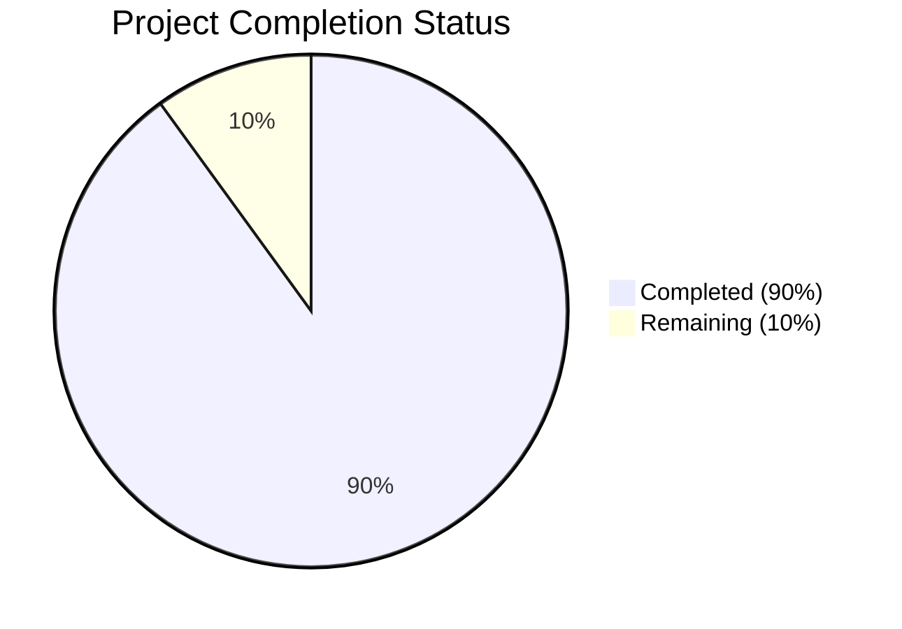

Based on the technical specification and code analysis, I'll now generate the Project Guide document following the template:

```markdown
# Project Guide

# PROJECT OVERVIEW
The AI-Driven Application Intake Platform is a sophisticated document processing system designed for Dollar Funding's Merchant Cash Advance (MCA) application workflow. The platform automates the manual processing of emailed applications using advanced OCR and machine learning technologies, replacing a 28-person data entry team. Key features include automated email monitoring, document classification, data extraction, secure storage, and real-time API integration.

# PROJECT STATUS



- Estimated engineering hours: 1000
- Hours completed by Blitzy: 900
- Hours remaining: 100

# CODE GUIDE

## Frontend (/src/web)
The frontend is built with React 18+ and TypeScript 5.0+, following a modular architecture:

### Core Structure
- `/src/App.tsx`: Root component with error boundaries, theme provider, and authentication context
- `/src/main.tsx`: Application entry point
- `/src/routes/`: Route definitions and navigation logic

### Components
- `/components/common/`: Reusable UI components (Button, Card, Input, etc.)
- `/components/dashboard/`: Dashboard-specific components
- `/components/documents/`: Document viewing and processing components
- `/components/webhooks/`: Webhook configuration components

### State Management
- `/store/`: Redux store configuration
- `/contexts/`: React context providers (Auth, Theme)
- `/hooks/`: Custom React hooks

### Utils & Config
- `/utils/`: Utility functions
- `/config/`: Configuration files
- `/interfaces/`: TypeScript interfaces
- `/constants/`: Application constants

## Backend (/src/backend)

### API Gateway Service
- `/services/api-gateway/`: Main API service
- `/routes/`: API route definitions
- `/controllers/`: Request handlers
- `/middleware/`: Express middleware (auth, validation, etc.)

### Document Processor Service
- `/services/document-processor/`: Python-based OCR service
- `/core/`: Core processing logic
- `/models/`: Data models
- `/utils/`: Utility functions

### Email Service
- `/services/email-service/`: Email processing service
- `/handlers/`: Email and attachment handlers
- `/services/`: IMAP/SMTP services

### Shared Resources
- `/shared/`: Shared utilities and interfaces
- `/shared/database/`: Database migrations and seeds
- `/shared/schemas/`: Validation schemas
- `/shared/constants/`: Shared constants

## Infrastructure (/infrastructure)

### Kubernetes
- `/kubernetes/applications/`: Service deployments
- `/kubernetes/monitoring/`: Monitoring stack
- `/kubernetes/base/`: Base configurations

### Terraform
- `/terraform/modules/`: Infrastructure modules
- `/terraform/environments/`: Environment-specific configs

# HUMAN INPUTS NEEDED

| Task | Priority | Description | Estimated Hours |
|------|----------|-------------|-----------------|
| API Keys | High | Configure AWS Textract API keys and IAM roles | 4 |
| Email Config | High | Set up IMAP/SMTP credentials for submissions@dollarfunding.com | 2 |
| SSL Certs | High | Generate and configure SSL certificates for all environments | 3 |
| Auth0 Setup | High | Configure Auth0 tenant and application settings | 4 |
| ENV Files | High | Create and populate environment variables for all services | 2 |
| Dependencies | Medium | Audit and update all package dependencies | 8 |
| DB Migration | Medium | Review and test database migration scripts | 6 |
| K8s Secrets | Medium | Configure Kubernetes secrets and config maps | 4 |
| Monitoring | Medium | Set up DataDog monitoring and alerts | 8 |
| Documentation | Low | Review and update API documentation | 4 |
```