# Technical Specifications

# 1. INTRODUCTION

## 1.1 EXECUTIVE SUMMARY

The AI-Driven Application Intake Platform represents a transformative solution for Dollar Funding's Merchant Cash Advance (MCA) application processing workflow. This system automates the manual processing of emailed applications, replacing a 28-person data entry team with an intelligent document processing pipeline. By leveraging advanced OCR and machine learning technologies, the platform will reduce processing time from hours to minutes while maintaining high accuracy in data extraction. The system targets Dollar Funding's operations team as primary users and aims to process over 1000 applications daily with 95%+ accuracy.

## 1.2 SYSTEM OVERVIEW

### Project Context

| Aspect | Description |
|--------|-------------|
| Business Context | Dollar Funding's competitive advantage depends on rapid MCA application processing in a high-volume market |
| Current Limitations | Manual data entry creates bottlenecks, introduces errors, and limits scalability |
| Enterprise Integration | System will integrate with existing email infrastructure and downstream CRM systems |

### High-Level Description

| Component | Implementation |
|-----------|----------------|
| Email Processing | Automated monitoring of submissions@dollarfunding.com with attachment extraction |
| Document Processing | AI-powered classification and OCR for both printed and handwritten text |
| Data Extraction | Structured extraction of merchant details, financial data, and owner information |
| Storage & Security | Encrypted document storage with role-based access control |
| Integration | RESTful API and webhook system for real-time updates |

### Success Criteria

| Metric | Target |
|--------|--------|
| Processing Time | < 5 minutes per application |
| OCR Accuracy | > 95% for clear documents |
| System Uptime | 99.9% availability |
| Processing Capacity | 1000+ daily applications |
| Cost Reduction | 80% reduction in manual processing costs |

## 1.3 SCOPE

### In-Scope Elements

#### Core Features and Functionalities

| Category | Components |
|----------|------------|
| Document Processing | - Email monitoring and attachment extraction<br>- Document classification<br>- OCR processing<br>- Data extraction and validation |
| Data Management | - Secure document storage<br>- Structured data storage<br>- Application status tracking |
| Integration | - RESTful API endpoints<br>- Webhook notifications<br>- Email server integration |
| User Interface | - Web-based administrative dashboard<br>- Document viewer<br>- Configuration management |

#### Implementation Boundaries

| Boundary Type | Coverage |
|--------------|----------|
| User Groups | - Operations team<br>- System administrators<br>- API integration users |
| Document Types | - Bank statements<br>- ISO Applications<br>- Voided checks |
| Data Domains | - Merchant information<br>- Financial data<br>- Owner details |
| Geographic Coverage | - United States operations |

### Out-of-Scope Elements

| Category | Excluded Elements |
|----------|------------------|
| Document Types | - Non-PDF formats<br>- Image-only files<br>- Encrypted documents |
| Processing | - Manual data entry interface<br>- Document creation/editing<br>- Custom document templates |
| Integration | - Direct CRM system modifications<br>- Legacy system migration<br>- Third-party payment processing |
| Features | - Mobile application<br>- Offline processing<br>- Custom reporting tools |

# 2. SYSTEM ARCHITECTURE

## 2.1 High-Level Architecture

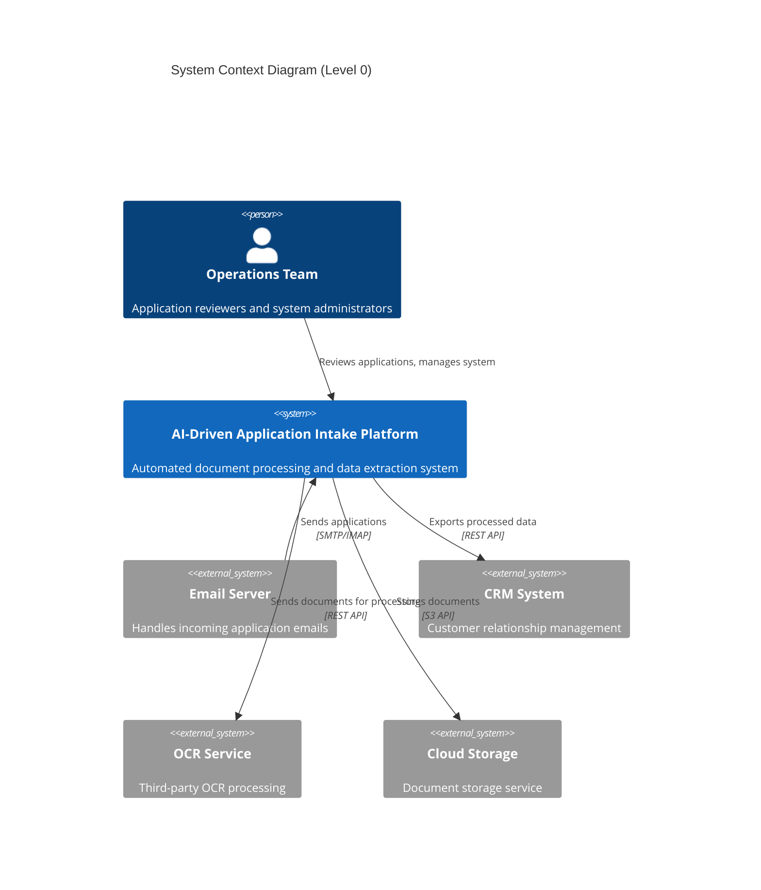
```mermaid
C4Context
    title System Context Diagram (Level 0)

    Person(ops, "Operations Team", "Application reviewers and system administrators")
    System(platform, "AI-Driven Application Intake Platform", "Automated document processing and data extraction system")
    System_Ext(email, "Email Server", "Handles incoming application emails")
    System_Ext(crm, "CRM System", "Customer relationship management")
    System_Ext(ocr, "OCR Service", "Third-party OCR processing")
    System_Ext(storage, "Cloud Storage", "Document storage service")
    
    Rel(ops, platform, "Reviews applications, manages system")
    Rel(email, platform, "Sends applications", "SMTP/IMAP")
    Rel(platform, crm, "Exports processed data", "REST API")
    Rel(platform, ocr, "Sends documents for processing", "REST API")
    Rel(platform, storage, "Stores documents", "S3 API")
```

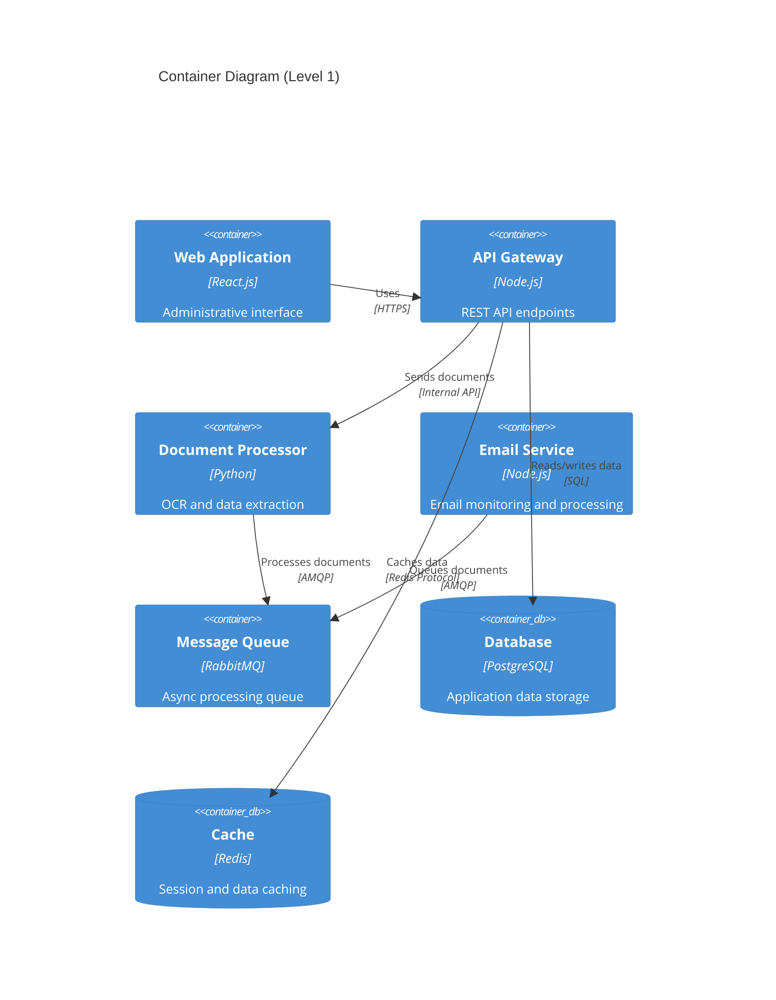
```mermaid
C4Container
    title Container Diagram (Level 1)

    Container(web, "Web Application", "React.js", "Administrative interface")
    Container(api, "API Gateway", "Node.js", "REST API endpoints")
    Container(proc, "Document Processor", "Python", "OCR and data extraction")
    Container(email, "Email Service", "Node.js", "Email monitoring and processing")
    Container(queue, "Message Queue", "RabbitMQ", "Async processing queue")
    ContainerDb(db, "Database", "PostgreSQL", "Application data storage")
    ContainerDb(cache, "Cache", "Redis", "Session and data caching")
    
    Rel(web, api, "Uses", "HTTPS")
    Rel(api, proc, "Sends documents", "Internal API")
    Rel(email, queue, "Queues documents", "AMQP")
    Rel(proc, queue, "Processes documents", "AMQP")
    Rel(api, db, "Reads/writes data", "SQL")
    Rel(api, cache, "Caches data", "Redis Protocol")
```

## 2.2 Component Details

### 2.2.1 Core Components

| Component | Purpose | Technology Stack | Scaling Strategy |
|-----------|---------|-----------------|------------------|
| Web Interface | Administrative dashboard | React.js, Material-UI | Horizontal scaling with CDN |
| API Gateway | Request handling and routing | Node.js, Express | Auto-scaling based on load |
| Document Processor | OCR and data extraction | Python, TensorFlow | Queue-based worker scaling |
| Email Service | Email monitoring | Node.js, IMAP/SMTP | Multiple instances per region |
| Message Queue | Async processing | RabbitMQ | Clustered deployment |
| Database | Data persistence | PostgreSQL | Read replicas, sharding |
| Cache | Performance optimization | Redis | Master-replica setup |

### 2.2.2 Component Interactions

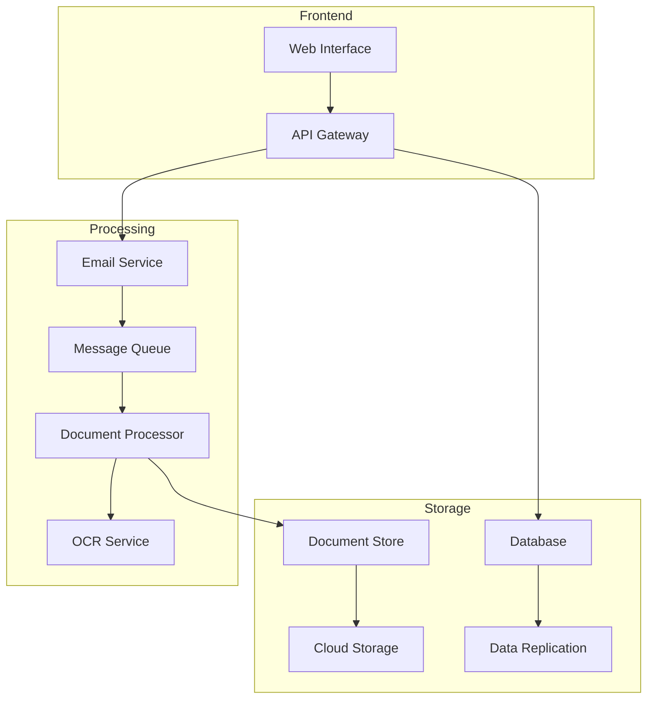
```mermaid
flowchart TD
    subgraph Frontend
    A[Web Interface] --> B[API Gateway]
    end
    
    subgraph Processing
    C[Email Service] --> D[Message Queue]
    D --> E[Document Processor]
    E --> F[OCR Service]
    end
    
    subgraph Storage
    G[Document Store] --> H[Cloud Storage]
    I[Database] --> J[Data Replication]
    end
    
    B --> C
    E --> G
    B --> I
```

## 2.3 Technical Decisions

### 2.3.1 Architecture Patterns

| Pattern | Implementation | Justification |
|---------|---------------|---------------|
| Microservices | Loosely coupled services | Scalability and maintainability |
| Event-Driven | Message queue for processing | Asynchronous document handling |
| CQRS | Separate read/write models | Optimized data access patterns |
| API Gateway | Centralized entry point | Security and request routing |

### 2.3.2 Data Storage Strategy

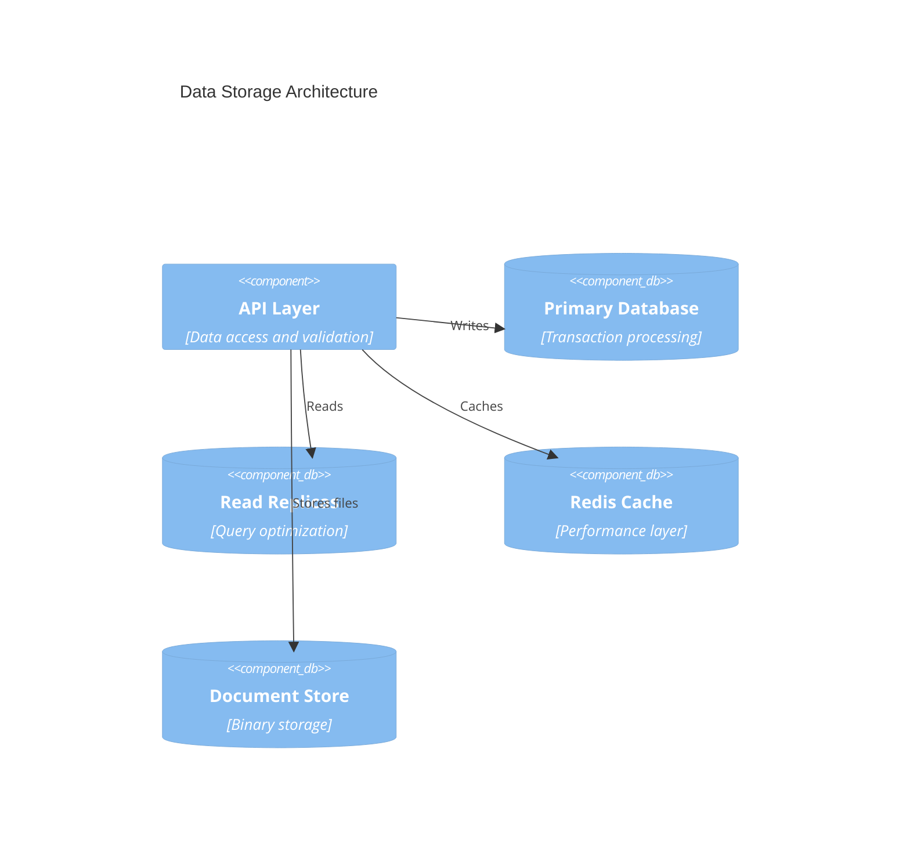
```mermaid
C4Component
    title Data Storage Architecture

    Component(api, "API Layer", "Data access and validation")
    ComponentDb(primary, "Primary Database", "Transaction processing")
    ComponentDb(replica, "Read Replicas", "Query optimization")
    ComponentDb(cache, "Redis Cache", "Performance layer")
    ComponentDb(docs, "Document Store", "Binary storage")
    
    Rel(api, primary, "Writes")
    Rel(api, replica, "Reads")
    Rel(api, cache, "Caches")
    Rel(api, docs, "Stores files")
```

## 2.4 Cross-Cutting Concerns

### 2.4.1 Monitoring and Observability

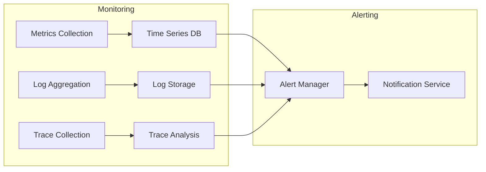
```mermaid
flowchart LR
    subgraph Monitoring
    A[Metrics Collection] --> B[Time Series DB]
    C[Log Aggregation] --> D[Log Storage]
    E[Trace Collection] --> F[Trace Analysis]
    end
    
    subgraph Alerting
    B --> G[Alert Manager]
    D --> G
    F --> G
    G --> H[Notification Service]
    end
```

### 2.4.2 Security Architecture

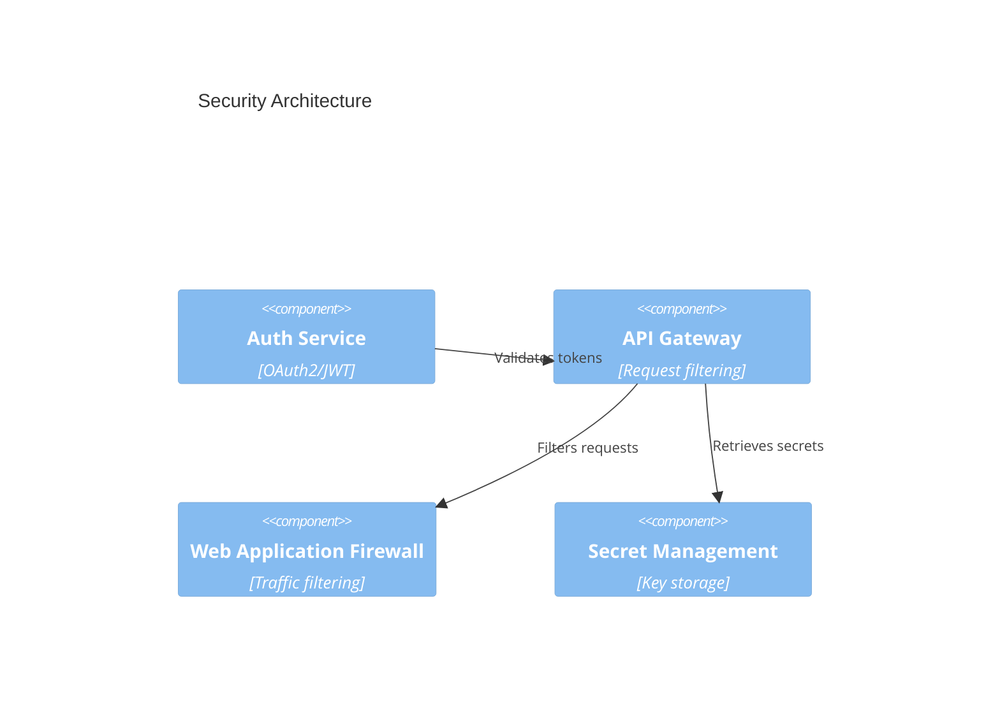
```mermaid
C4Component
    title Security Architecture

    Component(auth, "Auth Service", "OAuth2/JWT")
    Component(gateway, "API Gateway", "Request filtering")
    Component(waf, "Web Application Firewall", "Traffic filtering")
    Component(vault, "Secret Management", "Key storage")
    
    Rel(auth, gateway, "Validates tokens")
    Rel(gateway, waf, "Filters requests")
    Rel(gateway, vault, "Retrieves secrets")
```

## 2.5 Deployment Architecture

```mermaid
deployment
    title Production Deployment Architecture

    node "CDN" {
        component[Static Assets]
    }
    
    node "Load Balancer" {
        component[HAProxy]
    }
    
    node "Application Tier" {
        component[Web Servers]
        component[API Servers]
    }
    
    node "Processing Tier" {
        component[Document Processors]
        component[Queue Workers]
    }
    
    node "Data Tier" {
        database[Primary DB]
        database[Replica DB]
        database[Redis Cache]
    }
    
    node "Storage" {
        database[Document Store]
    }
```

# 3. SYSTEM COMPONENTS ARCHITECTURE

## 3.1 USER INTERFACE DESIGN

### 3.1.1 Design Specifications

| Category | Requirements |
|----------|--------------|
| Visual Hierarchy | - Card-based layout for applications<br>- Status-driven color coding<br>- Progressive disclosure for complex data |
| Component Library | Material-UI v5 with custom theme<br>- Standardized form controls<br>- Data tables with sorting/filtering<br>- Document preview components |
| Responsive Design | - Breakpoints: 320px, 768px, 1024px, 1440px<br>- Mobile-first approach<br>- Fluid typography (16px base) |
| Accessibility | - WCAG 2.1 Level AA compliance<br>- ARIA labels and roles<br>- Keyboard navigation support<br>- Screen reader optimization |
| Browser Support | - Chrome 90+<br>- Firefox 88+<br>- Safari 14+<br>- Edge 90+ |
| Theme Support | - Light/Dark mode toggle<br>- System preference detection<br>- Persistent user preference |

### 3.1.2 Interface Elements

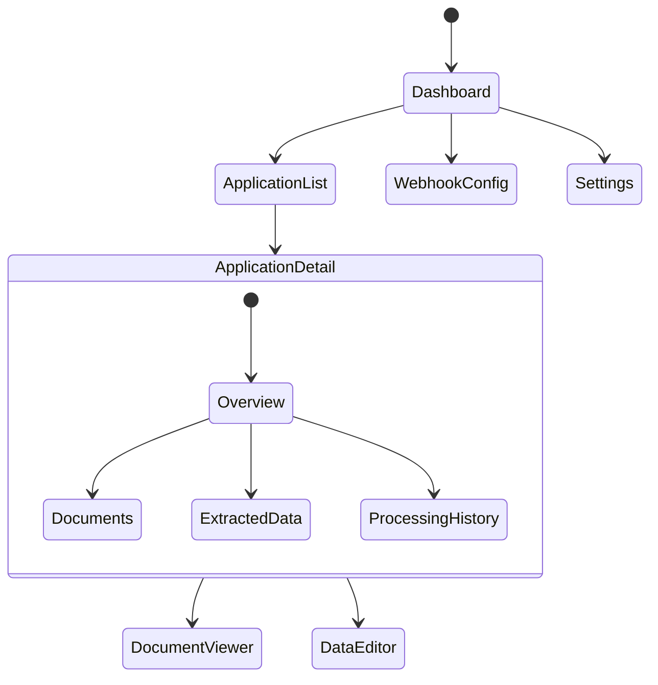
```mermaid
stateDiagram-v2
    [*] --> Dashboard
    Dashboard --> ApplicationList
    Dashboard --> WebhookConfig
    Dashboard --> Settings
    
    ApplicationList --> ApplicationDetail
    ApplicationDetail --> DocumentViewer
    ApplicationDetail --> DataEditor
    
    state ApplicationDetail {
        [*] --> Overview
        Overview --> Documents
        Overview --> ExtractedData
        Overview --> ProcessingHistory
    }
```

### 3.1.3 Critical User Flows

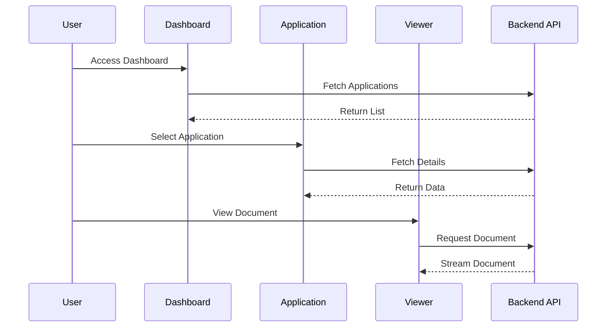
```mermaid
sequenceDiagram
    participant U as User
    participant D as Dashboard
    participant A as Application
    participant V as Viewer
    participant API as Backend API

    U->>D: Access Dashboard
    D->>API: Fetch Applications
    API-->>D: Return List
    U->>A: Select Application
    A->>API: Fetch Details
    API-->>A: Return Data
    U->>V: View Document
    V->>API: Request Document
    API-->>V: Stream Document
```

## 3.2 DATABASE DESIGN

### 3.2.1 Schema Design

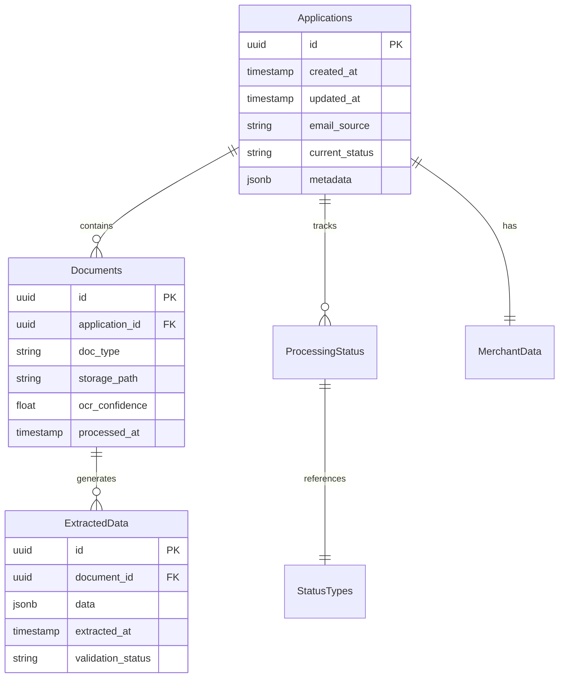
```mermaid
erDiagram
    Applications ||--o{ Documents : contains
    Applications ||--o{ ProcessingStatus : tracks
    Applications ||--|| MerchantData : has
    Documents ||--o{ ExtractedData : generates
    ProcessingStatus ||--|| StatusTypes : references
    
    Applications {
        uuid id PK
        timestamp created_at
        timestamp updated_at
        string email_source
        string current_status
        jsonb metadata
    }
    
    Documents {
        uuid id PK
        uuid application_id FK
        string doc_type
        string storage_path
        float ocr_confidence
        timestamp processed_at
    }
    
    ExtractedData {
        uuid id PK
        uuid document_id FK
        jsonb data
        timestamp extracted_at
        string validation_status
    }
```

### 3.2.2 Data Management Strategy

| Aspect | Implementation |
|--------|---------------|
| Partitioning | - Monthly partitions for applications<br>- Quarterly partitions for documents<br>- Annual partitions for audit logs |
| Indexing | - B-tree indexes on lookup fields<br>- GiST indexes for full-text search<br>- Partial indexes for active records |
| Archival | - 90-day active retention<br>- 1-year warm storage<br>- 7-year cold storage |
| Backup | - Hourly incremental backups<br>- Daily full backups<br>- Cross-region replication |

## 3.3 API DESIGN

### 3.3.1 API Architecture

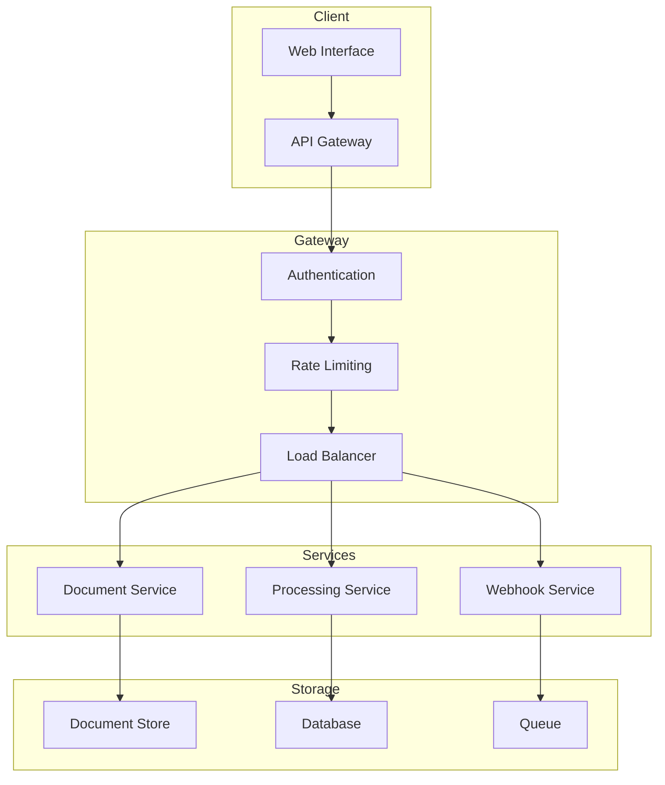
```mermaid
flowchart TD
    subgraph Client
    A[Web Interface] --> B[API Gateway]
    end
    
    subgraph Gateway
    B --> C[Authentication]
    C --> D[Rate Limiting]
    D --> E[Load Balancer]
    end
    
    subgraph Services
    E --> F[Document Service]
    E --> G[Processing Service]
    E --> H[Webhook Service]
    end
    
    subgraph Storage
    F --> I[Document Store]
    G --> J[Database]
    H --> K[Queue]
    end
```

### 3.3.2 Interface Specifications

| Endpoint | Method | Purpose | Request Format | Response Format |
|----------|--------|---------|----------------|-----------------|
| /api/v1/applications | GET | List applications | Query params | JSON collection |
| /api/v1/applications/{id} | GET | Get application details | Path param | JSON object |
| /api/v1/documents/{id} | GET | Get document | Path param | Binary/PDF |
| /api/v1/webhooks | POST | Register webhook | JSON body | JSON response |

### 3.3.3 Authentication Flow

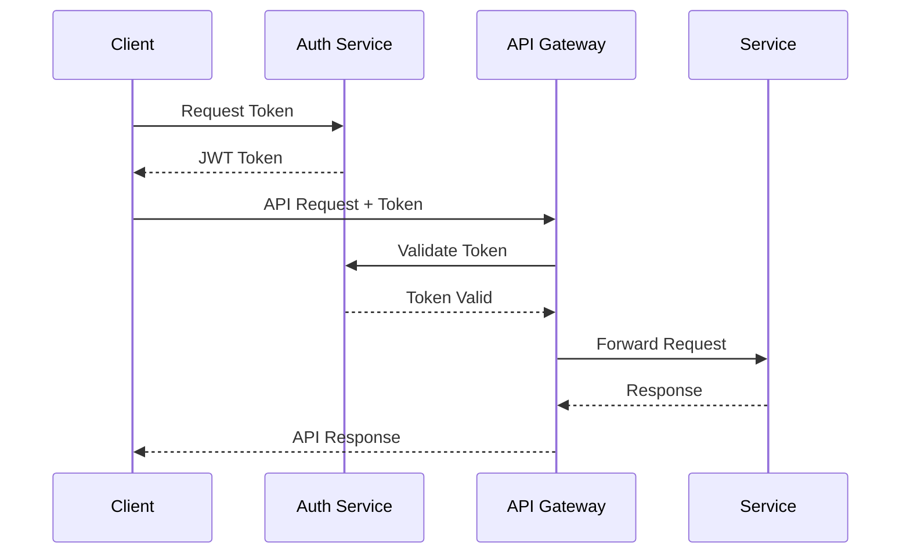
```mermaid
sequenceDiagram
    participant C as Client
    participant A as Auth Service
    participant API as API Gateway
    participant S as Service

    C->>A: Request Token
    A-->>C: JWT Token
    C->>API: API Request + Token
    API->>A: Validate Token
    A-->>API: Token Valid
    API->>S: Forward Request
    S-->>API: Response
    API-->>C: API Response
```

### 3.3.4 Integration Requirements

| Component | Integration Method | Security Requirements |
|-----------|-------------------|---------------------|
| Email Server | IMAP/SMTP | TLS 1.3, OAuth 2.0 |
| OCR Service | REST API | API Key, IP Whitelist |
| Document Storage | S3 API | IAM Roles, Server-side Encryption |
| CRM System | Webhook | HMAC Signatures, TLS 1.3 |

# 4. TECHNOLOGY STACK

## 4.1 PROGRAMMING LANGUAGES

| Platform/Component | Language | Version | Justification |
|-------------------|----------|---------|---------------|
| Backend API | Node.js | 18 LTS | - Event-driven architecture support<br>- Large ecosystem for email processing<br>- Strong async/await capabilities |
| Document Processing | Python | 3.11+ | - Rich ML/OCR library ecosystem<br>- Superior text processing capabilities<br>- Native async support |
| Frontend | TypeScript | 5.0+ | - Type safety for complex data structures<br>- Enhanced developer productivity<br>- Better maintainability |
| Database Scripts | SQL | ANSI | - Complex data relationships<br>- Transaction requirements<br>- Data integrity needs |

## 4.2 FRAMEWORKS & LIBRARIES

### Backend Frameworks

| Framework | Version | Purpose | Justification |
|-----------|---------|---------|---------------|
| Express.js | 4.18+ | API Gateway | - Mature ecosystem<br>- Middleware support<br>- Easy integration |
| FastAPI | 0.100+ | Document Processing | - High performance<br>- Native async support<br>- OpenAPI integration |
| React | 18+ | Web Interface | - Component reusability<br>- Virtual DOM performance<br>- Rich ecosystem |
| Material-UI | 5+ | UI Components | - WCAG compliance<br>- Responsive design<br>- Customization options |

### Supporting Libraries

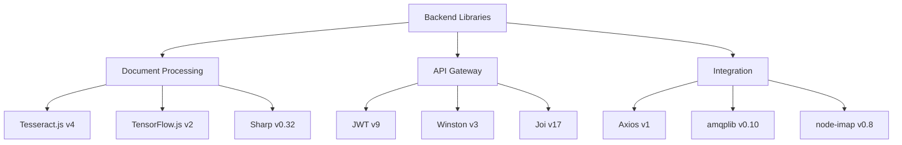
```mermaid
graph TD
    A[Backend Libraries] --> B[Document Processing]
    A --> C[API Gateway]
    A --> D[Integration]
    
    B --> B1[Tesseract.js v4]
    B --> B2[TensorFlow.js v2]
    B --> B3[Sharp v0.32]
    
    C --> C1[JWT v9]
    C --> C2[Winston v3]
    C --> C3[Joi v17]
    
    D --> D1[Axios v1]
    D --> D2[amqplib v0.10]
    D --> D3[node-imap v0.8]
```

## 4.3 DATABASES & STORAGE

### Primary Databases

| Type | Technology | Version | Purpose |
|------|------------|---------|----------|
| RDBMS | PostgreSQL | 15+ | - Application data<br>- Transaction processing<br>- Audit logging |
| Cache | Redis | 7+ | - Session management<br>- Rate limiting<br>- Real-time updates |
| Search | Elasticsearch | 8+ | - Full-text search<br>- Application search<br>- Analytics |

### Storage Architecture

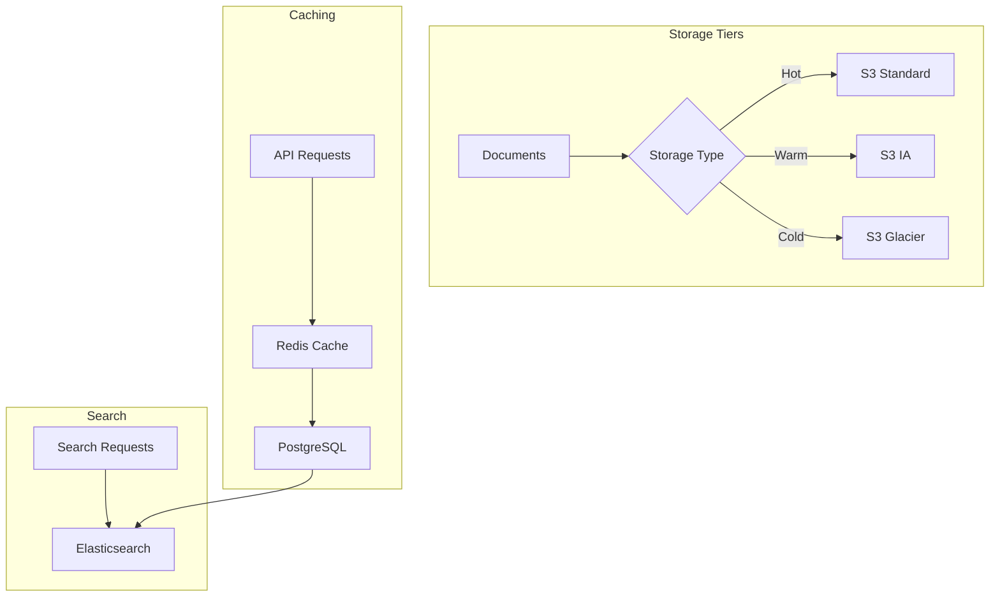
```mermaid
flowchart TD
    subgraph Storage Tiers
    A[Documents] --> B{Storage Type}
    B -->|Hot| C[S3 Standard]
    B -->|Warm| D[S3 IA]
    B -->|Cold| E[S3 Glacier]
    end
    
    subgraph Caching
    F[API Requests] --> G[Redis Cache]
    G --> H[PostgreSQL]
    end
    
    subgraph Search
    I[Search Requests] --> J[Elasticsearch]
    H --> J
    end
```

## 4.4 THIRD-PARTY SERVICES

| Category | Service | Purpose | Integration Method |
|----------|---------|---------|-------------------|
| OCR | AWS Textract | Document processing | REST API |
| Email | AWS SES | Email handling | SDK |
| Authentication | Auth0 | User management | OAuth 2.0 |
| Monitoring | DataDog | System monitoring | Agent-based |
| Cloud Storage | AWS S3 | Document storage | SDK |

## 4.5 DEVELOPMENT & DEPLOYMENT

### Development Tools

| Category | Tool | Version | Purpose |
|----------|------|---------|----------|
| IDE | VS Code | Latest | Primary development |
| API Testing | Postman | Latest | API development |
| Version Control | Git | 2.40+ | Source control |
| Package Management | npm/pip | Latest | Dependency management |

### Deployment Pipeline

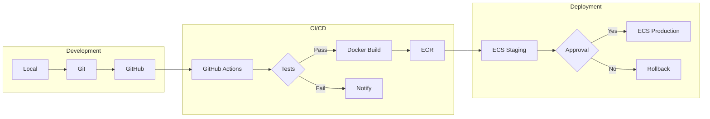
```mermaid
flowchart LR
    subgraph Development
    A[Local] --> B[Git]
    B --> C[GitHub]
    end
    
    subgraph CI/CD
    C --> D[GitHub Actions]
    D --> E{Tests}
    E -->|Pass| F[Docker Build]
    E -->|Fail| G[Notify]
    F --> H[ECR]
    end
    
    subgraph Deployment
    H --> I[ECS Staging]
    I --> J{Approval}
    J -->|Yes| K[ECS Production]
    J -->|No| L[Rollback]
    end
```

### Infrastructure Requirements

| Component | Specification | Scaling Strategy |
|-----------|---------------|------------------|
| API Servers | t3.large | Auto-scaling group |
| Processing Nodes | c6i.2xlarge | Queue-based scaling |
| Database | db.r6g.xlarge | Read replicas |
| Cache | cache.r6g.large | Cluster mode |
| Load Balancer | ALB | Cross-zone |

# 5. SYSTEM DESIGN

## 5.1 USER INTERFACE DESIGN

### 5.1.1 Dashboard Layout

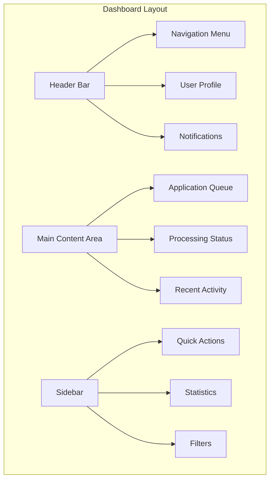
```mermaid
graph TD
    subgraph Dashboard Layout
    A[Header Bar] --> B[Navigation Menu]
    A --> C[User Profile]
    A --> D[Notifications]
    
    E[Main Content Area] --> F[Application Queue]
    E --> G[Processing Status]
    E --> H[Recent Activity]
    
    I[Sidebar] --> J[Quick Actions]
    I --> K[Statistics]
    I --> L[Filters]
    end
```

### 5.1.2 Application Review Interface

| Component | Description | Functionality |
|-----------|-------------|---------------|
| Document Viewer | Split-screen layout | - Original document display<br>- Extracted data side panel<br>- Zoom/pan controls |
| Data Fields | Form-based layout | - Editable extracted fields<br>- Validation indicators<br>- Field history tracking |
| Action Panel | Top-aligned toolbar | - Approve/Reject buttons<br>- Save progress<br>- Request review |

### 5.1.3 Webhook Configuration Interface

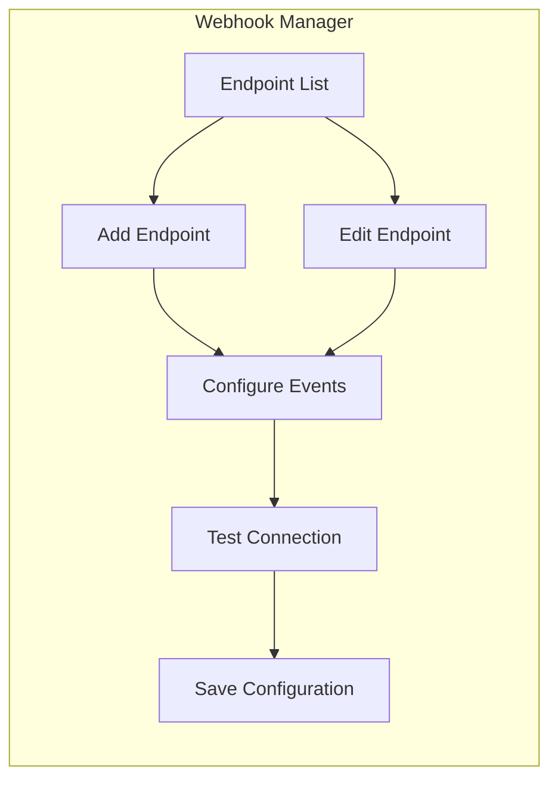
```mermaid
graph LR
    subgraph Webhook Manager
    A[Endpoint List] --> B[Add Endpoint]
    A --> C[Edit Endpoint]
    
    B --> D[Configure Events]
    C --> D
    
    D --> E[Test Connection]
    E --> F[Save Configuration]
    end
```

## 5.2 DATABASE DESIGN

### 5.2.1 Schema Design


```mermaid
erDiagram
    Applications ||--o{ Documents : contains
    Applications ||--o{ ProcessingStatus : tracks
    Applications ||--|| MerchantData : has
    Documents ||--o{ ExtractedData : generates
    ProcessingStatus ||--|| StatusTypes : references
    
    Applications {
        uuid id PK
        timestamp created_at
        timestamp updated_at
        string email_source
        string current_status
        jsonb metadata
    }
    
    Documents {
        uuid id PK
        uuid application_id FK
        string doc_type
        string storage_path
        float ocr_confidence
        timestamp processed_at
    }
    
    ExtractedData {
        uuid id PK
        uuid document_id FK
        jsonb data
        timestamp extracted_at
        string validation_status
    }
```

### 5.2.2 Indexing Strategy

| Table | Index Type | Fields | Purpose |
|-------|------------|--------|----------|
| Applications | B-tree | (created_at, current_status) | Queue management |
| Documents | B-tree | (application_id, doc_type) | Document lookup |
| ExtractedData | GiST | (data) | JSON field search |
| ProcessingStatus | B-tree | (application_id, timestamp) | Status tracking |

## 5.3 API DESIGN

### 5.3.1 RESTful Endpoints

| Endpoint | Method | Purpose | Request Format | Response Format |
|----------|--------|---------|----------------|-----------------|
| /api/v1/applications | GET | List applications | Query params | JSON collection |
| /api/v1/applications/{id} | GET | Get application details | Path param | JSON object |
| /api/v1/documents/{id} | GET | Get document | Path param | Binary/PDF |
| /api/v1/webhooks | POST | Register webhook | JSON body | JSON response |

### 5.3.2 Authentication Flow

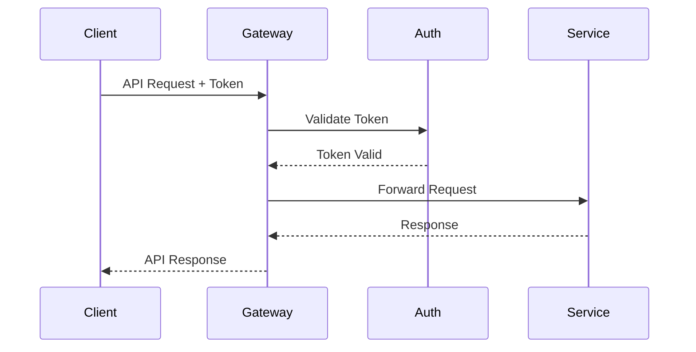
```mermaid
sequenceDiagram
    participant Client
    participant Gateway
    participant Auth
    participant Service

    Client->>Gateway: API Request + Token
    Gateway->>Auth: Validate Token
    Auth-->>Gateway: Token Valid
    Gateway->>Service: Forward Request
    Service-->>Gateway: Response
    Gateway-->>Client: API Response
```

### 5.3.3 Webhook Integration

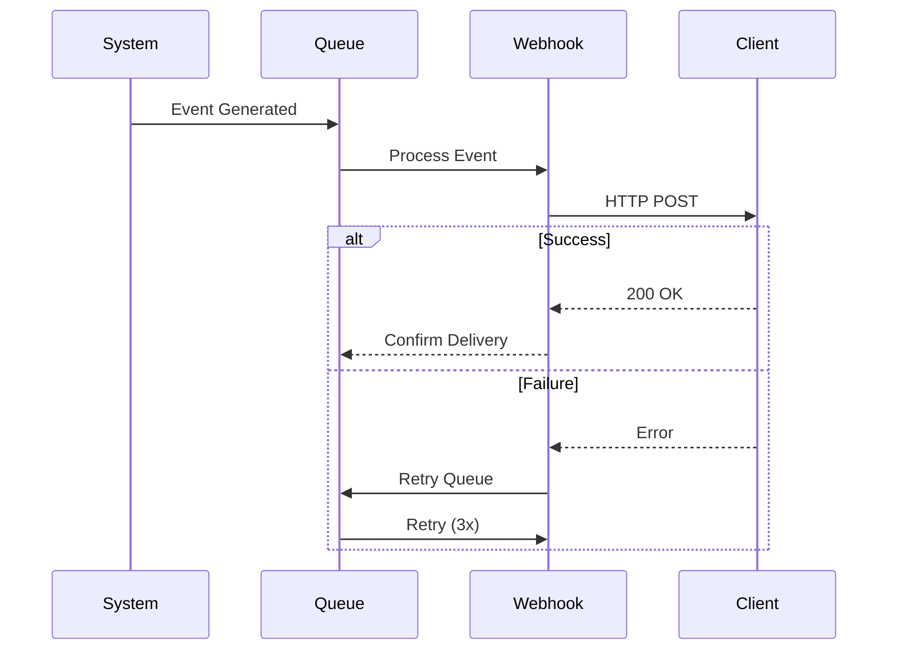
```mermaid
sequenceDiagram
    participant System
    participant Queue
    participant Webhook
    participant Client

    System->>Queue: Event Generated
    Queue->>Webhook: Process Event
    Webhook->>Client: HTTP POST
    alt Success
        Client-->>Webhook: 200 OK
        Webhook-->>Queue: Confirm Delivery
    else Failure
        Client-->>Webhook: Error
        Webhook->>Queue: Retry Queue
        Queue->>Webhook: Retry (3x)
    end
```

### 5.3.4 Rate Limiting

| API Tier | Rate Limit | Burst Limit | Window |
|----------|------------|-------------|--------|
| Standard | 1000/hour | 100/minute | Rolling |
| Premium | 5000/hour | 500/minute | Rolling |
| Internal | Unlimited | 1000/minute | Rolling |

### 5.3.5 Error Handling

| Error Code | Description | Response Format |
|------------|-------------|-----------------|
| 400 | Bad Request | `{"error": "message", "code": "ERR_CODE"}` |
| 401 | Unauthorized | `{"error": "Authentication required"}` |
| 403 | Forbidden | `{"error": "Insufficient permissions"}` |
| 429 | Rate Limited | `{"error": "Rate limit exceeded", "retry_after": 123}` |

# 6. USER INTERFACE DESIGN

## 6.1 Design System

### Icon Key
```
[#] Dashboard/Menu     [@] User/Profile    [?] Help/Info
[$] Financial         [i] Information     [+] Add/Create
[x] Close/Delete      [<] Previous        [>] Next
[^] Upload            [=] Settings        [!] Alert/Warning
[*] Important         [v] Dropdown        [ ] Checkbox
```

## 6.2 Main Dashboard

```
+----------------------------------------------------------+
|  [#] AI Application Intake      [@] Admin    [?] Help     |
+----------------------------------------------------------+
|                                                           |
|  +------------------+  +------------------+               |
|  | New Applications |  | Processing Queue |               |
|  | [====     ] 45%  |  | [========  ] 80% |               |
|  | 23 Pending       |  | 156 Processing   |               |
|  +------------------+  +------------------+               |
|                                                           |
|  [*] Recent Applications                                  |
|  +--------------------------------------------------+    |
|  | Business Name    | Status    | Time     | Action  |    |
|  |--------------------------------------------------+    |
|  | ABC Corp         | Complete  | 2m ago   | [View]  |    |
|  | XYZ LLC          | Failed    | 5m ago   | [Retry] |    |
|  | 123 Holdings     | Processing| 8m ago   | [View]  |    |
|  +--------------------------------------------------+    |
|                                                           |
|  [+] Add Application    [^] Bulk Upload                  |
+----------------------------------------------------------+
```

## 6.3 Application Review Interface

```
+----------------------------------------------------------+
|  [<] Back to Dashboard    Application #A12345             |
+----------------------------------------------------------+
|                                                           |
|  +------------------------+  +-------------------------+   |
|  | Document Preview       |  | Extracted Data         |   |
|  |                       |  | Business Information    |   |
|  | [PDF VIEWER]          |  | Name: [...............]|   |
|  |                       |  | EIN:  [...............]|   |
|  | [< Prev] [Next >]     |  | DBA:  [...............]|   |
|  |                       |  |                         |   |
|  | Pages: 1 of 3        |  | Owner Information       |   |
|  +------------------------+  | Name: [...............]|   |
|                            | SSN:  [...............]|   |
|  Document Type:            | DOB:  [...............]|   |
|  [v] Bank Statement       |  +-------------------------+   |
|                                                           |
|  Confidence Score: 95%     [!] 2 Fields Need Review      |
|                                                           |
|  [Save Draft]  [Request Review]  [Approve]               |
+----------------------------------------------------------+
```

## 6.4 Webhook Configuration

```
+----------------------------------------------------------+
|  [=] System Configuration    Webhook Management           |
+----------------------------------------------------------+
|                                                           |
|  [+] Add New Webhook Endpoint                            |
|                                                           |
|  Active Webhooks                                         |
|  +--------------------------------------------------+    |
|  | Endpoint URL           | Events         | Status  |    |
|  |--------------------------------------------------+    |
|  | https://api.crm.com   | [ ] New App    | Active  |    |
|  |                       | [x] Complete    | [Test]  |    |
|  |                       | [x] Failed      | [x]     |    |
|  |--------------------------------------------------+    |
|  | https://erp.system... | [x] All Events | Active  |    |
|  |                       |                | [Test]  |    |
|  |                       |                | [x]     |    |
|  +--------------------------------------------------+    |
|                                                           |
|  [Save Changes]                                          |
+----------------------------------------------------------+
```

## 6.5 Document Processing Queue

```
+----------------------------------------------------------+
|  [#] Processing Queue     Filter: [v] All Statuses       |
+----------------------------------------------------------+
|                                                           |
|  Queue Statistics                                         |
|  +------------------+  +------------------+               |
|  | Processing Speed |  | Success Rate     |               |
|  | [==========] 100%|  | [========  ] 80% |               |
|  | 4.2s avg        |  | 156/180 docs     |               |
|  +------------------+  +------------------+               |
|                                                           |
|  Active Documents                                         |
|  +--------------------------------------------------+    |
|  | Document ID | Type    | Progress  | Time    | Action   |
|  |--------------------------------------------------+    |
|  | DOC-001    | Bank    | [====  ]  | 1:23    | [Stop]   |
|  | DOC-002    | App     | [=     ]  | 0:45    | [Stop]   |
|  | DOC-003    | Check   | [       ] | Queue   | [Start]  |
|  +--------------------------------------------------+    |
|                                                           |
|  [Pause All]  [Resume All]  [Clear Failed]               |
+----------------------------------------------------------+
```

## 6.6 Responsive Design Specifications

| Breakpoint | Layout Adjustments |
|------------|-------------------|
| Desktop (1200px+) | Full dashboard with side-by-side panels |
| Tablet (768px-1199px) | Stacked panels, condensed navigation |
| Mobile (320px-767px) | Single column, collapsible sections |

## 6.7 Component Library

| Component | Usage | States |
|-----------|-------|--------|
| Primary Button | Key actions | Default, Hover, Active, Disabled |
| Secondary Button | Alternative actions | Default, Hover, Active, Disabled |
| Input Field | Data entry | Default, Focus, Error, Success |
| Dropdown | Selection menus | Default, Open, Selected, Disabled |
| Alert Banner | System messages | Info, Success, Warning, Error |
| Progress Bar | Status indication | Empty, Partial, Complete, Error |

## 6.8 Interaction Patterns

| Action | Response |
|--------|----------|
| Document Upload | Progress indicator, success/failure notification |
| Data Validation | Real-time field validation, inline error messages |
| Form Submission | Loading state, success confirmation, error handling |
| Queue Management | Real-time updates, status changes, action confirmation |
| Configuration Changes | Save confirmation, validation feedback, undo option |

# 7. SECURITY CONSIDERATIONS

## 7.1 AUTHENTICATION AND AUTHORIZATION

### 7.1.1 Authentication Methods

| Method | Use Case | Implementation |
|--------|----------|----------------|
| OAuth 2.0 + JWT | Web Interface Access | - JWT tokens with 1-hour expiry<br>- Refresh tokens with 24-hour expiry<br>- MFA required for admin access |
| API Keys | Programmatic Access | - Rotating keys with 90-day expiry<br>- IP whitelisting<br>- Rate limiting per key |
| Service Accounts | Inter-service Communication | - IAM roles with least privilege<br>- Short-lived credentials<br>- Automated rotation |

### 7.1.2 Authorization Matrix

| Role | Document Access | Data Modification | System Config | User Management |
|------|----------------|-------------------|---------------|-----------------|
| Admin | Full Access | Full Access | Full Access | Full Access |
| Operator | View All | Edit Assigned | View Only | No Access |
| Auditor | View All | No Access | No Access | No Access |
| API User | Configured Access | No Access | No Access | No Access |

```mermaid
flowchart TD
    A[Request] --> B{Authentication}
    B -->|Invalid| C[Reject]
    B -->|Valid| D{Authorization}
    D -->|Unauthorized| E[Deny Access]
    D -->|Authorized| F[Grant Access]
    F --> G{Role Check}
    G -->|Admin| H[Full Access]
    G -->|Operator| I[Limited Access]
    G -->|Auditor| J[Read Only]
```

## 7.2 DATA SECURITY

### 7.2.1 Encryption Standards

| Data State | Method | Key Management |
|------------|--------|----------------|
| In Transit | TLS 1.3 | - Automated certificate rotation<br>- Perfect Forward Secrecy<br>- Strong cipher suites only |
| At Rest | AES-256-GCM | - HSM-based key storage<br>- Automated key rotation<br>- Separate keys per environment |
| In Memory | Secure memory handling | - Memory encryption<br>- Secure key disposal<br>- Anti-dumping measures |

### 7.2.2 Sensitive Data Handling

```mermaid
flowchart LR
    subgraph Input
    A[Raw Data] --> B[Classification]
    end
    
    subgraph Processing
    B --> C{Data Type}
    C -->|PII| D[Encrypt]
    C -->|Financial| E[Encrypt]
    C -->|Standard| F[Process]
    end
    
    subgraph Storage
    D --> G[Secure Storage]
    E --> G
    F --> H[Standard Storage]
    end
```

| Data Type | Handling Method | Access Control |
|-----------|----------------|----------------|
| SSN/EIN | Encrypted, masked display | Role-based with audit |
| Financial Data | Encrypted, field-level access | Need-to-know basis |
| Business Info | Standard encryption | Role-based access |

## 7.3 SECURITY PROTOCOLS

### 7.3.1 Access Control Protocols

```mermaid
sequenceDiagram
    participant User
    participant Auth
    participant MFA
    participant Service
    participant Audit

    User->>Auth: Request Access
    Auth->>MFA: Require 2FA
    MFA-->>User: 2FA Challenge
    User->>MFA: 2FA Response
    MFA->>Service: Grant Access
    Service->>Audit: Log Access
```

### 7.3.2 Security Monitoring

| Component | Monitoring Method | Alert Threshold |
|-----------|------------------|-----------------|
| Failed Logins | Real-time tracking | 5 failures/5 minutes |
| API Usage | Rate monitoring | 80% of limit |
| Data Access | Pattern analysis | Unusual patterns |
| System Changes | Change tracking | Any unauthorized change |

### 7.3.3 Security Compliance

| Requirement | Implementation | Validation |
|-------------|----------------|------------|
| GLBA Compliance | - Data encryption<br>- Access controls<br>- Audit logging | Quarterly audits |
| SOC 2 Type II | - Security controls<br>- Process documentation<br>- Continuous monitoring | Annual certification |
| PCI DSS | - Secure transmission<br>- Data isolation<br>- Access restrictions | Regular assessments |

### 7.3.4 Incident Response

```mermaid
flowchart TD
    A[Detect Incident] --> B{Severity}
    B -->|High| C[Immediate Response]
    B -->|Medium| D[Standard Response]
    B -->|Low| E[Monitored Response]
    
    C --> F[System Isolation]
    C --> G[Executive Notice]
    
    D --> H[Investigation]
    D --> I[Containment]
    
    E --> J[Log & Monitor]
    E --> K[Regular Review]
    
    F --> L[Recovery]
    H --> L
    J --> L
```

# 8. INFRASTRUCTURE

## 8.1 DEPLOYMENT ENVIRONMENT

| Environment | Purpose | Configuration |
|-------------|----------|--------------|
| Development | Feature development and testing | - Single region deployment<br>- Reduced redundancy<br>- Development-grade instances |
| Staging | Pre-production testing and validation | - Production mirror<br>- Full redundancy<br>- Production-grade instances |
| Production | Live system operation | - Multi-region deployment<br>- Full redundancy<br>- Auto-scaling enabled |

### Environment Architecture

```mermaid
flowchart TD
    subgraph Production
    P1[Region US-East] --- P2[Region US-West]
    P1 --> P3[Disaster Recovery]
    end
    
    subgraph Staging
    S1[Staging Environment] --> S2[Pre-prod Testing]
    end
    
    subgraph Development
    D1[Dev Environment] --> D2[Integration Testing]
    end
    
    Development --> Staging
    Staging --> Production
```

## 8.2 CLOUD SERVICES

| Service | Provider | Purpose | Justification |
|---------|----------|---------|---------------|
| Compute | AWS ECS | Application hosting | - Container optimization<br>- Auto-scaling support<br>- Cost efficiency |
| Storage | AWS S3 | Document storage | - Durability (99.999999999%)<br>- Lifecycle management<br>- Encryption support |
| Database | AWS RDS | Data persistence | - Automated backups<br>- Multi-AZ deployment<br>- Managed service |
| Cache | AWS ElastiCache | Performance optimization | - Redis compatibility<br>- Cluster mode<br>- In-memory performance |
| Queue | AWS SQS | Message queuing | - Managed service<br>- FIFO support<br>- Dead letter queues |
| CDN | AWS CloudFront | Content delivery | - Global edge locations<br>- SSL/TLS support<br>- DDoS protection |

## 8.3 CONTAINERIZATION

### Container Architecture

```mermaid
graph TD
    subgraph Container Images
    A[Base Image] --> B[Node.js Image]
    A --> C[Python Image]
    B --> D[API Service]
    B --> E[Web Service]
    C --> F[Document Processor]
    end
    
    subgraph Registry
    D --> G[ECR Repository]
    E --> G
    F --> G
    end
```

### Container Specifications

| Service | Base Image | Exposed Ports | Resource Limits |
|---------|------------|---------------|-----------------|
| API Service | node:18-alpine | 3000 | CPU: 2 vCPU<br>Memory: 4GB |
| Web Service | node:18-alpine | 80 | CPU: 1 vCPU<br>Memory: 2GB |
| Document Processor | python:3.11-slim | 8000 | CPU: 4 vCPU<br>Memory: 8GB |

## 8.4 ORCHESTRATION

### Kubernetes Configuration

```mermaid
flowchart TD
    subgraph EKS Cluster
    A[Ingress Controller] --> B[Service Mesh]
    B --> C[Pod Autoscaler]
    
    subgraph Services
    C --> D[API Pods]
    C --> E[Web Pods]
    C --> F[Processor Pods]
    end
    
    subgraph Storage
    G[EBS Volumes]
    H[EFS Mounts]
    end
    
    Services --> G
    Services --> H
    end
```

### Scaling Policies

| Service | Min Pods | Max Pods | Scale Trigger |
|---------|----------|----------|---------------|
| API Service | 2 | 10 | CPU > 70% |
| Web Service | 2 | 8 | Memory > 80% |
| Document Processor | 3 | 15 | Queue Length > 100 |

## 8.5 CI/CD PIPELINE

### Pipeline Architecture

```mermaid
flowchart LR
    subgraph Source
    A[GitHub Repository] --> B[GitHub Actions]
    end
    
    subgraph Build
    B --> C[Unit Tests]
    C --> D[Build Images]
    D --> E[Security Scan]
    end
    
    subgraph Deploy
    E --> F[Push to ECR]
    F --> G[Deploy to EKS]
    G --> H[Health Check]
    end
    
    subgraph Verify
    H --> I[Integration Tests]
    I --> J[Performance Tests]
    end
```

### Deployment Stages

| Stage | Actions | Success Criteria |
|-------|---------|-----------------|
| Build | - Code checkout<br>- Dependency installation<br>- Unit testing<br>- Container building | - All tests pass<br>- Build successful<br>- No security vulnerabilities |
| Test | - Integration testing<br>- Security scanning<br>- Performance testing | - API tests pass<br>- No critical vulnerabilities<br>- Performance within SLA |
| Deploy | - Container registry push<br>- Kubernetes deployment<br>- Health checks | - Images pushed successfully<br>- Pods running<br>- Health checks passing |
| Verify | - Smoke tests<br>- Monitoring check<br>- Alert configuration | - Core functionality working<br>- Metrics reporting<br>- Alerts configured |

# APPENDICES

## A.1 ADDITIONAL TECHNICAL INFORMATION

### A.1.1 Email Processing Specifications

| Component | Specification | Details |
|-----------|--------------|----------|
| IMAP Connection | Pooled connections | - Pool size: 5-10 connections<br>- Idle timeout: 5 minutes<br>- Reconnect strategy: Exponential backoff |
| Email Filtering | Rule-based | - Whitelist domains<br>- Size limits (25MB)<br>- Attachment count (max 10)<br>- Valid sender verification |
| Attachment Processing | Sequential | - PDF validation<br>- Virus scanning<br>- Metadata extraction<br>- Storage optimization |

### A.1.2 Document Processing Pipeline

```mermaid
flowchart TD
    A[Raw Document] --> B[Image Optimization]
    B --> C[OCR Preprocessing]
    C --> D[Text Extraction]
    D --> E[Data Validation]
    E --> F[Structured Output]
    
    subgraph Optimization
    B1[Deskew] --> B2[Noise Reduction]
    B2 --> B3[Resolution Adjustment]
    B3 --> B4[Format Conversion]
    end
    
    B --> Optimization
    Optimization --> C
```

## A.2 GLOSSARY

| Term | Definition |
|------|------------|
| Application Queue | A prioritized list of applications awaiting processing |
| Batch Processing | The automated processing of multiple applications as a group |
| Dead Letter Queue | A storage mechanism for failed processing attempts requiring manual intervention |
| Document Classification | The automated categorization of incoming documents based on content and structure |
| Extraction Template | A predefined pattern for identifying and extracting specific data fields |
| Field Validation | The process of verifying extracted data against predefined rules and formats |
| Processing Node | A server instance dedicated to document processing and data extraction |
| Webhook Endpoint | A URL that receives HTTP notifications for specific system events |

## A.3 ACRONYMS

| Acronym | Full Form |
|---------|-----------|
| AES | Advanced Encryption Standard |
| API | Application Programming Interface |
| CCPA | California Consumer Privacy Act |
| CDN | Content Delivery Network |
| CRUD | Create, Read, Update, Delete |
| DLQ | Dead Letter Queue |
| ECC | Error-Correcting Code |
| ECS | Elastic Container Service |
| EKS | Elastic Kubernetes Service |
| FIFO | First In, First Out |
| GLBA | Gramm-Leach-Bliley Act |
| HMAC | Hash-based Message Authentication Code |
| HSM | Hardware Security Module |
| IMAP | Internet Message Access Protocol |
| JWT | JSON Web Token |
| MFA | Multi-Factor Authentication |
| OCR | Optical Character Recognition |
| PII | Personally Identifiable Information |
| RBAC | Role-Based Access Control |
| REST | Representational State Transfer |
| RPO | Recovery Point Objective |
| RTO | Recovery Time Objective |
| SIEM | Security Information and Event Management |
| SMTP | Simple Mail Transfer Protocol |
| SOC | Service Organization Control |
| SSL | Secure Sockets Layer |
| TLS | Transport Layer Security |
| UTC | Coordinated Universal Time |
| WCAG | Web Content Accessibility Guidelines |