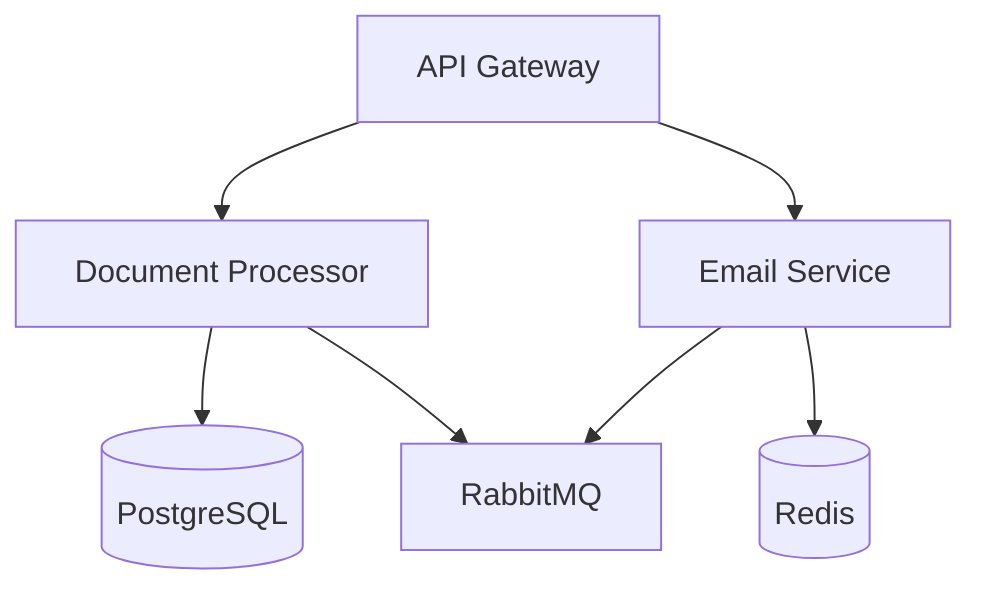

# AI-Driven Application Intake Platform - Backend Services

## Overview

The AI-Driven Application Intake Platform backend is a microservices-based system designed to automate the processing of Merchant Cash Advance (MCA) applications. This monorepo contains three core microservices:

- **API Gateway**: Central entry point handling authentication, routing and rate limiting
- **Document Processor**: AI-powered OCR and data extraction service
- **Email Service**: Automated email monitoring and attachment processing

### Architecture Diagram



## Prerequisites

- Node.js >= 18.0.0
- Python >= 3.11
- Docker >= 20.10.0
- Docker Compose >= 2.0.0
- PostgreSQL >= 15.0
- Redis >= 7.0
- RabbitMQ >= 3.11.0

## Getting Started

### Clone Repository
```bash
git clone <repository_url>
cd src/backend
```

### Environment Setup
```bash
# Install dependencies
npm install
lerna bootstrap

# Configure environment
cp .env.example .env

# Initialize development setup
npm run setup
```

### Development
```bash
# Start all services in development mode
npm run dev

# Run tests
npm run test

# Lint code
npm run lint

# Watch mode build
npm run build:watch

# Start Docker development environment
npm run docker:dev
```

### Build
```bash
# Clean build artifacts
npm run clean

# Build all services
npm run build

# Run test coverage
npm run test:coverage

# Build Docker images
docker-compose build

# Push Docker images
docker-compose push
```

### Deployment
```bash
# Verify deployment readiness
npm run deploy:check

# Deploy to production
docker-compose -f docker-compose.prod.yml up -d

# View logs
docker-compose -f docker-compose.prod.yml logs -f

# Check service health
npm run health-check
```

## Infrastructure Requirements

### Development Environment

| Service | Resources | Scaling | Monitoring |
|---------|-----------|----------|------------|
| API Gateway | 2 vCPU, 4GB RAM, 20GB SSD | 1 instance | Basic metrics |
| Document Processor | 4 vCPU, 8GB RAM, 50GB SSD | 1 instance | Basic metrics |
| Email Service | 1 vCPU, 2GB RAM, 10GB SSD | 1 instance | Basic metrics |

### Production Environment

| Service | Resources | Scaling | Monitoring |
|---------|-----------|----------|------------|
| API Gateway | 2-4 vCPU, 4-8GB RAM, 50GB SSD | 2-10 instances | Full metrics suite |
| Document Processor | 4-8 vCPU, 8-16GB RAM, 100GB SSD | 3-15 instances | Full metrics suite |
| Email Service | 1-2 vCPU, 2-4GB RAM, 20GB SSD | 2-5 instances | Full metrics suite |

## Security

### Authentication & Authorization
- JWT-based authentication
- Role-based access control (RBAC)
- OAuth2 support for service accounts

### Environment Variables
- Sensitive configuration managed via environment variables
- Secrets stored in secure vaults
- Production credentials never committed to repository

### Security Best Practices
- Regular security audits
- Automated vulnerability scanning
- Secure coding guidelines enforcement
- Data encryption at rest and in transit

## Troubleshooting

### Service Connection Errors
- Check service health endpoints
- Verify container logs
- Validate network configuration
- Confirm service health endpoint returns 200 OK

### Build Failures
- Verify Node.js version compatibility
- Check package dependencies
- Validate build configuration
- Ensure clean build with passing tests

### Performance Issues
- Monitor resource utilization
- Track scaling metrics
- Identify service bottlenecks
- Verify performance metrics against SLA

### Database Connection Issues
- Verify database credentials
- Validate connection strings
- Check network access
- Confirm successful database connection

## Contributing

1. Fork the repository
2. Create a feature branch
3. Commit your changes
4. Push to the branch
5. Create a Pull Request

## License

Copyright © 2024 Dollar Funding. All rights reserved.